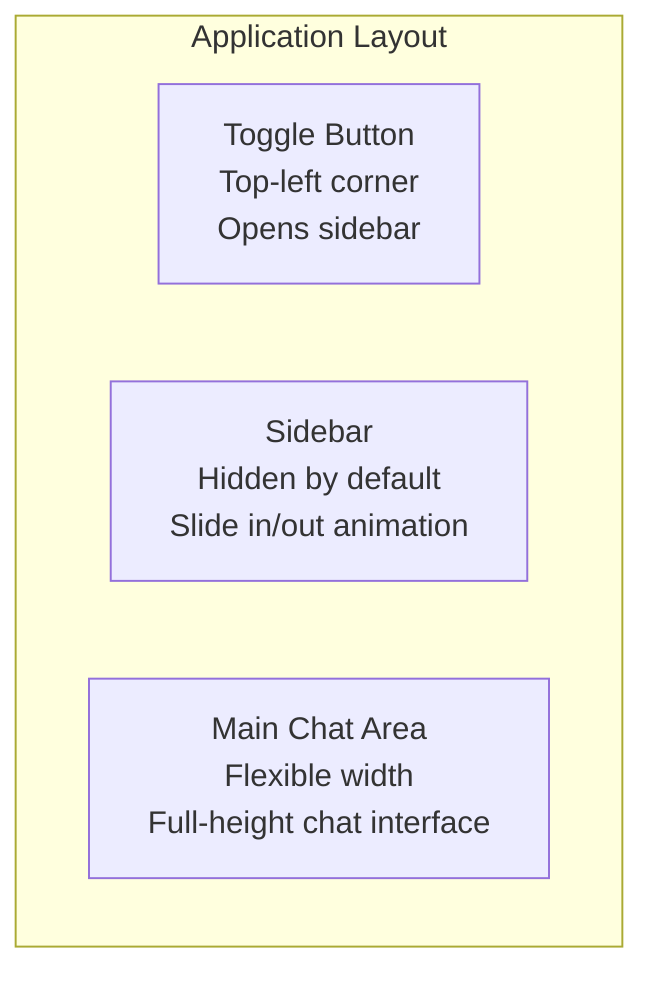

# AI Agent Implementation Design Document

## Version: v0 - Initial Agent Integration

---

## Overview

This document outlines the implementation design for integrating an AI agent into the Ore AI application. The primary goal of this v0 release is to establish a functional AI agent that can receive user messages, provide streaming responses, and lay the foundation for future tool integrations.

### Objectives

1. **Establish the Chat Interface**: Create a responsive, accessible chat UI matching the existing design aesthetic
2. **Enable Streaming Responses**: Implement real-time streaming of AI responses using Cloudflare Workers AI
3. **Session Persistence**: Store chat history per user in the database for continuity across sessions
4. **Authentication Integration**: Ensure only authenticated users can access the AI agent
5. **Production-Ready Foundation**: Build extensible architecture for future tool integrations

---

## Technology Stack Summary

| Layer | Technology |
|-------|------------|
| **Framework** | Next.js 16 (App Router) with OpenNext Cloudflare adapter |
| **Language** | TypeScript |
| **Styling** | Tailwind CSS with shadcn/ui (base-nova theme) |
| **Component Library** | Base UI primitives via @base-ui/react |
| **Icons** | Hugeicons |
| **AI SDK** | Vercel AI SDK (ai, @ai-sdk/react) |
| **AI Provider** | Cloudflare Workers AI via workers-ai-provider |
| **Database** | Cloudflare D1 with Drizzle ORM |
| **Authentication** | Better Auth |
| **Runtime** | Cloudflare Workers |

---

## Architecture

### High-Level Data Flow

```mermaid
flowchart TB
    subgraph Client["Client (Browser)"]
        UI[Chat Interface]
        HC[useChat Hook]
        Transport[DefaultChatTransport]
    end

    subgraph NextJS["Next.js App Router"]
        API[API Route: POST /api/chat]
        Auth[Auth Check<br/>getSession]
    end

    subgraph AI["AI Processing"]
        SDK[streamText]
        Provider[workers-ai-provider]
        Model[@cf/meta/llama-3.1-8b-instruct-fp8]
    end

    subgraph Cloudflare["Cloudflare Edge"]
        AI_Run[Workers AI Inference]
        D1[(D1 Database)]
    end

    UI -->|1. User types message| HC
    HC -->|2. POST /api/chat| Transport
    Transport -->|3. JSON body + cookies| API
    API -->|4. Verify session| Auth
    Auth -->|5. Get/Verify session| D1
    API -->|6. streamText()| SDK
    SDK -->|7. Model request| Provider
    Provider -->|8. Inference| AI_Run
    AI_Run -->|9. Stream tokens| Provider
    Provider -->|10. Stream tokens| SDK
    SDK -->|11. SSE stream| Transport
    Transport -->|12. Update UI| HC
    HC -->|13. Render messages| UI

    D1 -->|Persist messages| API
```

---

## Authentication Layer

All chat API routes must verify authentication using Better Auth's server-side API.

### How to Implement

1. **Use the library-docs skill** to understand Better Auth's `auth.api.getSession` pattern
2. **Reference the Better Auth documentation** for Next.js integration patterns
3. **Pass cookies automatically** using the `credentials: 'include'` option in the chat transport

### Session Verification Pattern

The agent implementing this should:
- Use `auth.api.getSession({ headers })` in API routes
- Ensure headers are passed correctly from Next.js request context
- Handle the null response case for unauthenticated requests

---

## API Design

### Endpoints Required

| Endpoint | Method | Purpose |
|----------|--------|---------|
| `/api/chat` | POST | Send message, receive streaming response |
| `/api/chat/sessions` | GET | List user's chat sessions |
| `/api/chat/messages` | GET | Load messages for a session |
| `/api/chat/sessions/[id]` | DELETE | Delete a session |

### How to Implement API Routes

1. **Use the AI SDK skill** to find documentation on:
   - `streamText` function for streaming responses
   - `convertToModelMessages` for message format conversion
   - `toUIMessageStreamResponse` for SSE response handling

2. **Use the library-docs skill** for:
   - Cloudflare Workers AI provider setup via `workers-ai-provider`
   - Drizzle ORM database operations with D1

3. **Reference context7** for specific code patterns:
   - DefaultChatTransport configuration for authenticated requests
   - Error handling patterns with useChat hook

---

## UI/UX Design

### Design Philosophy

The AI agent interface must embody the application's established design language:

- **Aesthetic**: Refined minimal matching the existing sign-in page
- **Colors**: Use existing CSS variables from `globals.css` (primary, muted, foreground, etc.)
- **Typography**: Geist fonts (already configured in layout.tsx)
- **Motion**: Subtle transitions, respects `prefers-reduced-motion`
- **Components**: Use existing shadcn/ui Button component patterns

### Overall Aesthetic Direction

The chat interface should feel like a natural extension of the existing sign-in page aesthetic - clean, intentional, with careful attention to typography and spacing. Avoid generic "AI chatbot" aesthetics.

### Layout Structure



**Key Layout Decisions**:
- Sidebar is **closed by default**
- Small toggle button in the **top-left corner** opens the sidebar
- Sidebar slides in with a smooth animation
- Main chat area takes remaining space

### Components

#### Toggle Button

- Small button in the top-left corner of the main chat area
- Shows an icon (menu/hamburger or similar from Hugeicons)
- Fixed position, always visible regardless of scroll
- Subtle styling that doesn't distract from the chat

#### Sidebar

- **Hidden by default** - takes no horizontal space
- **Appears on toggle** - slides in from the left
- **Contains**:
  - "New Chat" button at the top
  - Scrollable list of previous conversations
  - Sign out option at the bottom
- **Width**: Enough to show conversation titles comfortably
- **Animation**: Smooth slide transition

#### Chat Main Area

- **Header**: Shows agent name and current model indicator
- **Message area**: Scrollable container with conversation history
- **Input area**: Fixed at bottom with text input and send button

#### Message Bubbles

- **User messages**: Right-aligned, primary color background
- **Assistant messages**: Left-aligned, muted/secondary background
- **Streaming**: Subtle visual indication when response is streaming
- **Spacing**: Comfortable padding and gap between messages

#### Input Area

- Multi-line text input that auto-grows
- Clear placeholder text
- Send button with loading state
- Keyboard shortcuts: Enter to send, Shift+Enter for new line

### Loading & Error States

- **Initial load**: Clean loading skeleton or spinner
- **Streaming**: Subtle indicator that response is in progress
- **Error**: Clear error message with retry option
- **Network issues**: Graceful degradation with reconnection提示

### Responsive Behavior

- **Mobile**: Sidebar becomes a full-screen overlay/drawer
- **Desktop**: Sidebar slides in over content (doesn't push)

### How to Implement UI

1. **Use the frontend-design skill** for:
   - Creating distinctive, production-grade components
   - Matching the existing aesthetic
   - Animation and micro-interaction details

2. **Reference existing components**:
   - Read `src/components/sign-in/` for component patterns
   - Use the same Button component variants
   - Follow the same CSS variable usage patterns

3. **Use the web-design-guidelines skill** for:
   - Accessibility requirements
   - Keyboard navigation
   - Focus management

---

## Data Model

### Schema Requirements

The database needs two main tables:

1. **chat_sessions**: Stores conversation sessions
   - Links to user (via userId)
   - Contains title, model selection, timestamps
   
2. **chat_messages**: Stores individual messages
   - Links to session (via sessionId)
   - Contains role (user/assistant), content, timestamps

### How to Implement

1. **Use the library-docs skill** to understand Drizzle ORM patterns already in the project
2. **Reference the existing auth schema** at `src/db/schema/auth.ts` for table definition patterns
3. **Create a new schema file** following the same conventions
4. **Run migrations** using the project's existing migration commands

---

## AI Provider Configuration

### Cloudflare Workers AI

The project uses Cloudflare Workers AI as the model provider.

### How to Configure

1. **Add AI binding to wrangler.jsonc**:
   - Use the wrangler skill to understand configuration format
   - Add the `ai` binding following existing D1 pattern

2. **Install the provider package**:
   - `workers-ai-provider` for Cloudflare Workers AI integration
   
3. **Create provider instance**:
   - Use `createWorkersAI` with the AI binding from environment

4. **Select a model**:
   - Use `@cf/meta/llama-3.1-8b-instruct-fp8` for v0 (fast, cost-effective)

---

## Implementation Workflow

### Recommended Order

1. **Database Setup**
   - Add AI binding to wrangler.jsonc
   - Create chat schema file
   - Run migration

2. **API Routes**
   - Implement POST /api/chat first (core functionality)
   - Add session/message CRUD endpoints
   - Test with authenticated requests

3. **UI Components**
   - Create chat page with auth check
   - Build sidebar component
   - Build chat main area
   - Build message bubbles
   - Build input component

4. **Integration**
   - Connect useChat to API routes
   - Handle loading/error states
   - Test streaming response
   - Test session persistence

---

## Key Skills & Tools to Use

| Task | Skill/Tool to Use |
|------|-------------------|
| Understanding Better Auth | library-docs + better-auth docs |
| AI SDK patterns (streamText, useChat) | ai-sdk skill + context7 |
| Cloudflare Workers AI | library-docs + web search |
| Creating UI components | frontend-design skill |
| Accessibility | web-design-guidelines skill |
| Wrangler configuration | wrangler skill |
| Drizzle ORM patterns | library-docs + existing schema |
| shadcn/ui patterns | Read existing components |

---

## Dependencies to Add

```bash
bun add ai @ai-sdk/react workers-ai-provider
```

---

## Out of Scope for v0

- Settings panel/menu
- Tool calling capabilities
- Rich content (images, code blocks in special formats)
- Voice input
- Multiple model selection UI
- Message editing

---

## References

- [AI SDK Documentation](https://ai-sdk.dev)
- [Cloudflare Workers AI](https://developers.cloudflare.com/workers-ai/)
- [Better Auth](https://www.better-auth.com)
- [shadcn/ui](https://ui.shadcn.com)
- Existing components in `src/components/sign-in/`
- Database schema in `src/db/schema/auth.ts`

---

*Document Version: 1.2*  
*Created: February 2026*  
*Status: Ready for Implementation*
