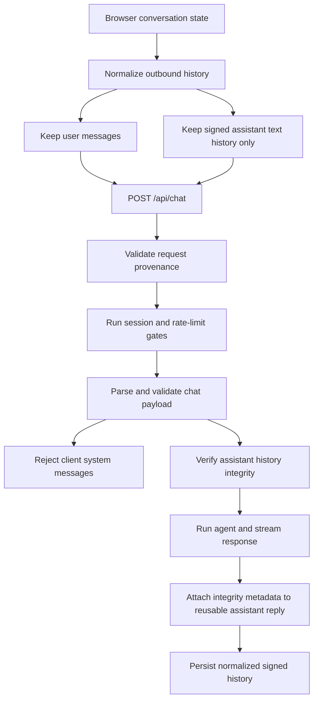

# Chat Request Security Specification

## Status

Accepted

## Purpose

Define the security requirements and request-handling contract for browser-originated chat traffic.

This document is safe to publish in an open-source repository. The design does not rely on secrecy of implementation details. Security depends on server-controlled secrets, strict validation, and fail-closed enforcement.

## Scope

This specification covers:

- browser-submitted chat history sent to `POST /api/chat`
- server validation of user and assistant message history
- provenance checks for cookie-backed POST requests
- signing of reusable assistant history

This specification does not cover:

- model prompt contents
- model provider safety controls
- authorization beyond session-access gating
- transport-layer protections provided by HTTPS or the hosting platform

## Threat Model Assumptions

The system MUST remain secure even if an adversary knows:

- the source code
- the request format
- the validation rules
- the signing algorithm
- the high-level architecture

The system MUST NOT rely on obscurity of client behavior, route structure, or document contents.

The system assumes the adversary does NOT have:

- access to server-held signing secrets
- the ability to forge valid server-issued session state without those secrets

## Security Goals

The chat request pipeline MUST:

1. treat all client-supplied non-user history as untrusted input
2. reject client-supplied `system` messages
3. accept assistant history only when it can be verified as server-generated
4. reject suspicious cross-site browser POST requests before expensive processing
5. fail closed when validation or verification cannot be completed

## Non-Goals

This design does NOT attempt to:

- prevent non-browser clients from sending requests
- hide the existence of validation or signing logic
- preserve every prior assistant UI detail for replay

## Normative Requirements

### 1. Client History Submission

- The client MUST submit prior `user` messages as plain request history.
- The client MUST normalize prior `assistant` history before resubmission.
- Normalized assistant history MUST contain only the reusable text form plus server-issued metadata.
- The client MUST NOT rely on locally persisted unsigned assistant messages being accepted by the server.

### 2. Provenance Enforcement

- Cookie-backed POST routes MUST validate browser provenance signals before session or model work begins.
- Requests with explicit provenance that does not match the application origin MUST be rejected.
- Requests with disallowed cross-site fetch metadata MUST be rejected.
- Missing provenance headers MAY be tolerated for compatibility with non-browser clients and operational tooling.

### 3. Message Validation

- The request body MUST be parsed as JSON and validated against the expected chat payload shape.
- `user` messages MUST contain only allowed text parts and MUST satisfy size limits.
- `assistant` messages MUST be normalized before signature verification.
- `system` messages from the client MUST be rejected.
- The latest accepted message MUST be a `user` message.

### 4. Assistant History Integrity

- Reusable assistant history MUST be accompanied by server-issued metadata containing an integrity signature.
- The server MUST recompute the expected signature from a canonicalized message payload and compare it using a timing-safe comparison.
- Assistant history that cannot be normalized or verified MUST be rejected.
- Verification failure MUST prevent model execution.

### 5. Response Signing

- When the server produces an assistant reply that is intended to become reusable history, it MUST attach new server-issued integrity metadata to that reply.
- Only the normalized assistant text form is required to be replayable across requests.
- The server MUST NOT trust the browser to mint or update assistant integrity metadata.

## Security Properties

Under this design:

- users can submit new prompts and previously issued signed assistant text history
- users cannot inject trusted `system` instructions through browser request history
- users cannot modify signed assistant history without invalidating the signature
- cross-site browser POST requests are rejected before reaching protected chat work

## Request Processing Flow

## Failure Handling

- Invalid provenance MUST produce a generic invalid-request response.
- Invalid payloads MUST produce generic client-error responses.
- Assistant verification failures MUST be treated as invalid requests.
- Security control failures MUST occur before model execution whenever possible.
- Error responses SHOULD avoid disclosing secret material or verification internals.

## Operational Notes

- This design is compatible with open-source publication because the security boundary is the server-held secret and the server’s enforcement behavior, not hidden code.
- Operational secret values, internal incident procedures, and emergency bypasses MUST NOT be documented in this specification.
- Future implementation changes MAY replace the cryptographic runtime primitive without changing this contract, as long as the integrity and fail-closed requirements remain satisfied.
